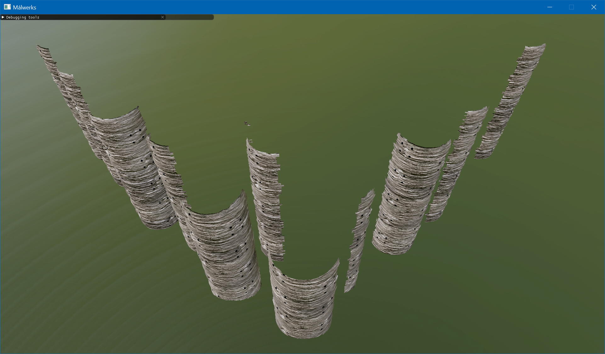
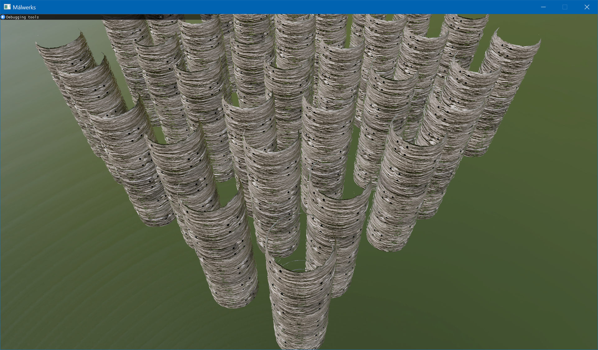

# Málwerks
A highly opinionated graphics research framework.

Please note that this is a personal pet project and I am not accepting pull requests at the moment.

Currently a bare-minimum PBR renderer with apex and occlusion culling is implemented, lantern model is from [Khronos glTF Sample Models](https://github.com/KhronosGroup/glTF-Sample-Models/tree/master/2.0/Lantern):

## Apex and occlusion culling

During mesh import time Málwerks splits it into clusters with ~120 triangles each, generates a bounding cone and an occlusion shape for each cluster and generates a buffer of draw commands that can be used to render it. Currently this is done using [meshoptimizer](https://meshoptimizer.org/).

Basically each cluster has a corresponding bounding cone, regular rendering index buffer and an occlusion shape index buffer. Both index buffers refer into the original mesh to save memory. On top of that, each cluster gets a unique draw command data that is used for indirect rendering.

Rendering that takes a few steps.

### Apex culling
First, apex culling compute shader is dispatched. This shader reads the bounding cone for each cluster and performs a fast check that rejects back-facing clusters and appends draw command data to the indirect arguments buffer that is used in the next step.

One extra compute shader is dispatched to generate a buffer with dispatch indirect arguments for the occluder resolve stage, this is a minor optimization and can probably be skipped.

This step outputs 3 buffers: "count" buffer that contains the amount of clusters that passed the test, a buffer with indirect draw arguments for occluders that passed the test and a similar indirect arguments buffer for regular draws.

### Occluder rendering

Next step is rendering occluder shapes for each cluster into a half-resolution depth buffer and a "cluster id" buffer. This cluster id buffer is a regular R32_UINT render target that contains cluster index from the previous step.

This step also uses a per-cluster visibility buffer with binary `0-1` values that are used to determine whether cluster is visible.

Rendering is performed with draw indirect calls with a count buffer that use buffers generated in the previous stage.
After occluders are rendered a special "post-processing" step is performed in the same render pass that reads cluster id buffer and outputs `1` to the per-cluster visibility buffer based on the cluster id for the current pixel.

### Occluder resolve

Finally a compute shader is dispatched that reads visibility buffer and appends indirect draw arguments to the final draw buffer that is later used for regular rendering. This step is very similar to apex culling step, except that instead of performing the cone test this reads the visibility flag.

When it's all done the scene is rendered in a regular fashion using draw indirect calls that use buffers generated in this stage.

### Benchmark

Here's an occlusion culling stress-test scene with an obscene amount of triangles and a huge amount of overdraw - there are 24 instances of one mesh in this scene, the mesh has 991232 vertices and 1486848 which results in 15488 clusters after processing and 371712 clusters in the entire scene.

This scene is specifically designed to stress-test this one particular rendering feature, real-world scenarios will likely be way less intense.

Textures used are from [CC0 Textures](https://cc0textures.com/)(by the way, you should consider donating to them).
All screenshots were captured in 1920x1080 resolution with an `NVIDIA RTX 2070` GPU in windowed mode on a 4K monitor.

This is a scene that has both apex culling and occlusion culling on. It is GPU-bound, so the "application frame time" we see here is the GPU time, which is *3.1ms*

Málwerks supports disabling occlusion culling for debug purposes, this makes the final rendering use indirect draw buffers from the apex culling stage directly and disables all occlusion culling passes. When occlusion culling is disabled, GPU performance drops to *4.8ms*

Disabling apex culling is supported in a similar fashion, by doing that we further decrease GPU performance to *5.7ms*. Please note that this is basically a cost of plain rendering without any overhead from extra rendering and compute passes.

Málwerks also supports "pausing" apex and occlusion culling for debug purposes, this effectively stops them but still uses generated buffers for the final pass. This allows us to see what the GPU is actually rendering from that particular camera perspective. You can see that all back facing and occluded clusters are completely gone.

### Further improvements and known issues

This implementation is currently very slow because occluder generation code is not generating good occluders - there are too many triangles and a lot of performance is wasted right now. Ideally this needs some sort of convex decomposition and occluders should be just convex hulls for each cluster with as few triangles as possible.

Rendering occluders to a half-resolution render target has some precision and quad occupancy issues and may be very slow in some cases - convex hull extraction should solve quad occupancy issue in theory and conservative rasterization should solve the precision issue.

## Renderer testing

Málwerks supports headless rendering and this feature is used to test the renderer. All rendering lives in `malwerks_render` crate and is completely abstracted from windowing and actual application and rendering tests are implemented in that crate as well.

Testing is performed by rendering a test world multiple times from different camera positions and angles and comparing rendered results to some reference images stored on disk. When some of these tests fail - the maintainer should look at provided test images and difference images to figure out what to do next - either update the reference image or fix what's broken.

The test system is capturing all intermediate render pass textures (like shadow maps and depth buffers) instead of a final image. This way it should be easier to identify a potential problem earlier without manually checking all of that in the gpu debugger.

Here's how failed and passed rendering tests look like:

