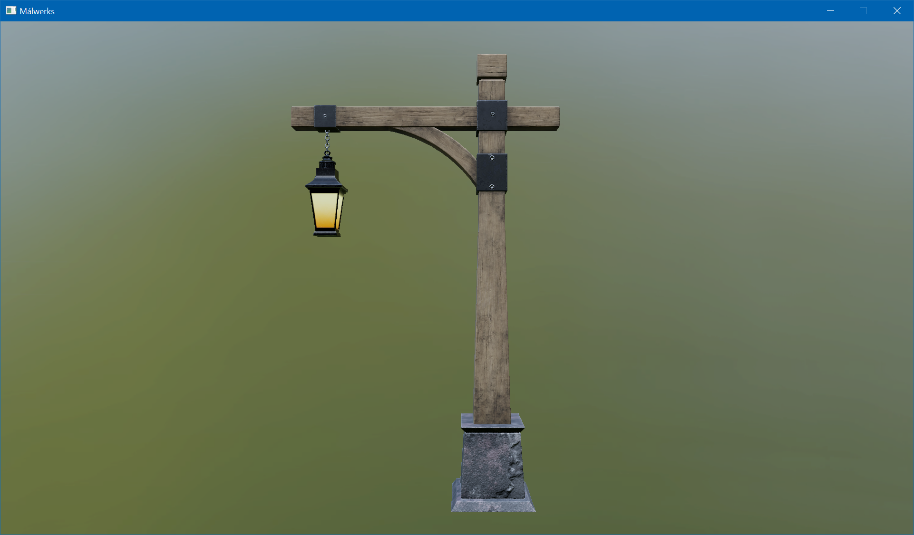
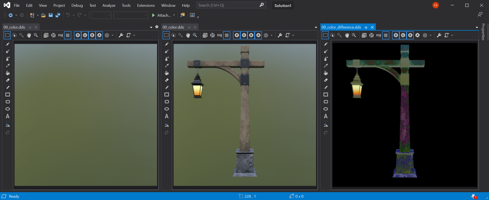
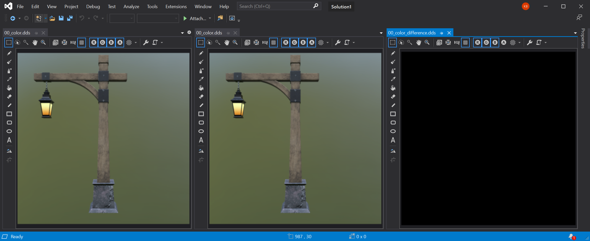

# Málwerks
A highly opinionated graphics research framework

Currently a bare-minimum PBR renderer is implemented, lantern model is from [Khronos glTF Sample Models](https://github.com/KhronosGroup/glTF-Sample-Models/tree/master/2.0/Lantern):

## Renderer testing

Málwerks supports headless rendering and this feature is used to test the renderer. All rendering lives in `malwerks_render` crate and is completely abstracted from windowing and actual application and rendering tests are implemented in that crate as well.

Testing is performed by rendering a test world multiple times from different camera positions and angles and comparing rendered results to some reference images stored on disk. When some of these tests fail - the maintainer should look at provided test images and difference images to figure out what to do next - either update the reference image or fix what's broken.

The test system is capturing all intermediate render pass textures (like shadow maps and depth buffers) instead of a final image. This way it should be easier to identify a potential problem earlier without manually checking all of that in the gpu debugger.

Here's how failed and passed rendering tests look like:

